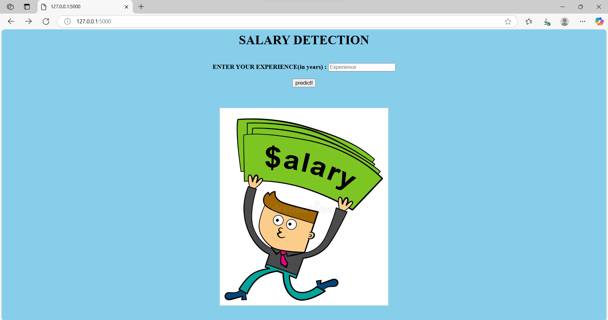
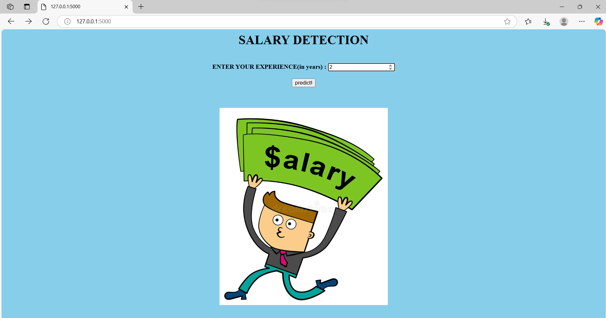
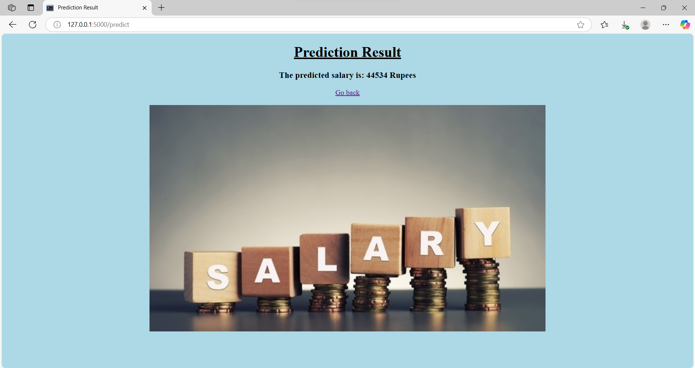

# Salary Prediction Web Application
This project is a simple web application built with Flask that predicts salary based on years of experience using a Linear Regression model. The application allows users to input a value (years of experience) and displays the predicted salary
## Table of Contents
- Project Overview
- Features
- Technologies Used
- Usage
- screenshots
- License
- Acknowledgments
## Project Overview
- The goal of this project is to demonstrate how to:
- Train a Linear Regression model using a dataset (Salary_Data.csv).
- Save the trained model using pickle.
- Build a Flask web application to serve predictions.
- Deploy the application locally and interact with it via a web interface.
## Features
- **User Input**: Users can input the number of years of experience.
- **Salary Prediction**: The application predicts the salary based on the input.
- **Simple Interface**: A clean and intuitive web interface for interaction.
## Technologies Used
- **Python**: Programming language used for the backend and model training.
- **Flask**: Web framework for building the application.
- **Scikit-learn**: Library for training the Linear Regression model.
- **Pandas**: Library for data manipulation and analysis.
- **NumPy**: Library for numerical computations.
- **HTML/CSS**: For creating the web interface.
- **Pickle**: For saving and loading the trained model.
## Usage
- Open the application in your browser.
- Enter the number of years of experience in the input field.
- Click the "Predict!" button.
- The predicted salary will be displayed on the next page.
## Screenshots
### Home Page

### Home Page with Input Data

### Prediction Page

## License
This project is licensed under the MIT License. See the [LICENSE](LICENSE) file for details.

## Acknowledgments
- Thanks to [Scikit-learn](https://scikit-learn.org/) for providing the Linear Regression model.
- Special thanks to [Flask](https://flask.palletsprojects.com/) for making web development simple and intuitive.
